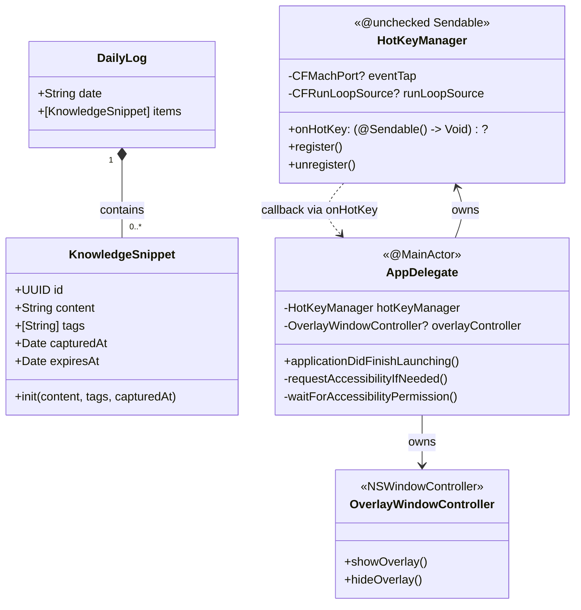

# Class Diagram

> Last updated by PR #19 — KnowledgeSnippet and DailyLog models

## Notes
- `HotKeyManager` is `@unchecked Sendable` — access pattern is safe because `register()` is called once on the main thread and the CFRunLoop callback only invokes `onHotKey` which is assigned before registration.
- `OverlayWindowController` wraps an `NSPanel` with `.floating` level and `.nonactivatingPanel` style mask so the overlay appears above all windows without stealing focus.
- Hotkey is `⌘⇧M` via `CGEventTap` (requires Accessibility permission, not Input Monitoring).
