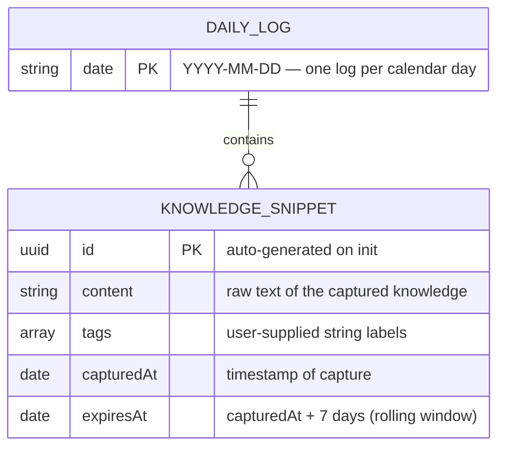

# Entity Relationship Diagram

> Last updated by PR #19 — KnowledgeSnippet and DailyLog models

## Storage model (v1)
- Persistence: flat JSON files, one file per `DAILY_LOG` date key
- Location: `~/Library/Application Support/Mnemos/logs/YYYY-MM-DD.json`
- Retention: files older than 7 days are pruned on next launch
- No cloud sync in v1 — local only

## Future entities (post-MVP)
| Entity | Purpose |
|--------|---------|
| `Tag` | Normalised tag with colour + description |
| `Skill` | Executable AI prompt derived from a set of snippets |
| `SyncRecord` | Cloud sync manifest for multi-device support |
