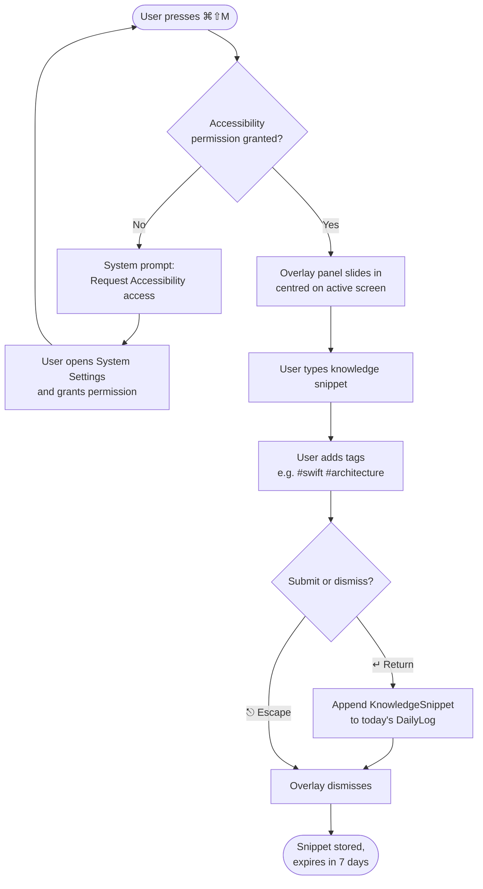
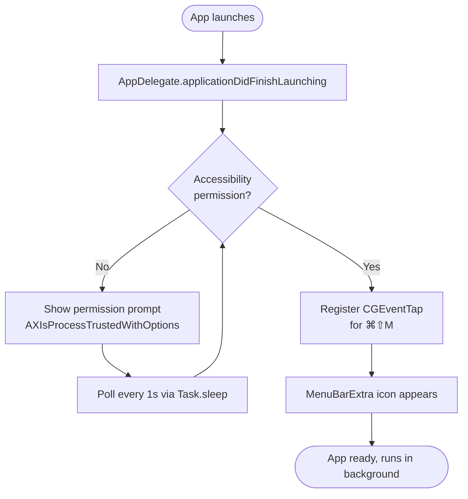
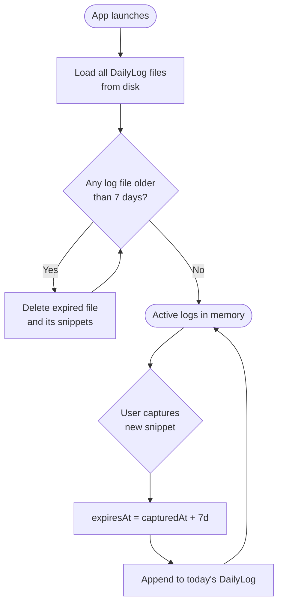
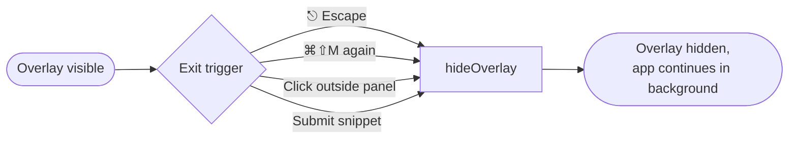

# User Flows

> Last updated by PR #6 — overlay shell (hotkey + NSPanel)

---

## Flow 1: Knowledge Capture (primary flow)

---

## Flow 2: App Launch

---

## Flow 3: Snippet Expiry (rolling 7-day window)

---

## Flow 4: Overlay Dismiss (all exit paths)

