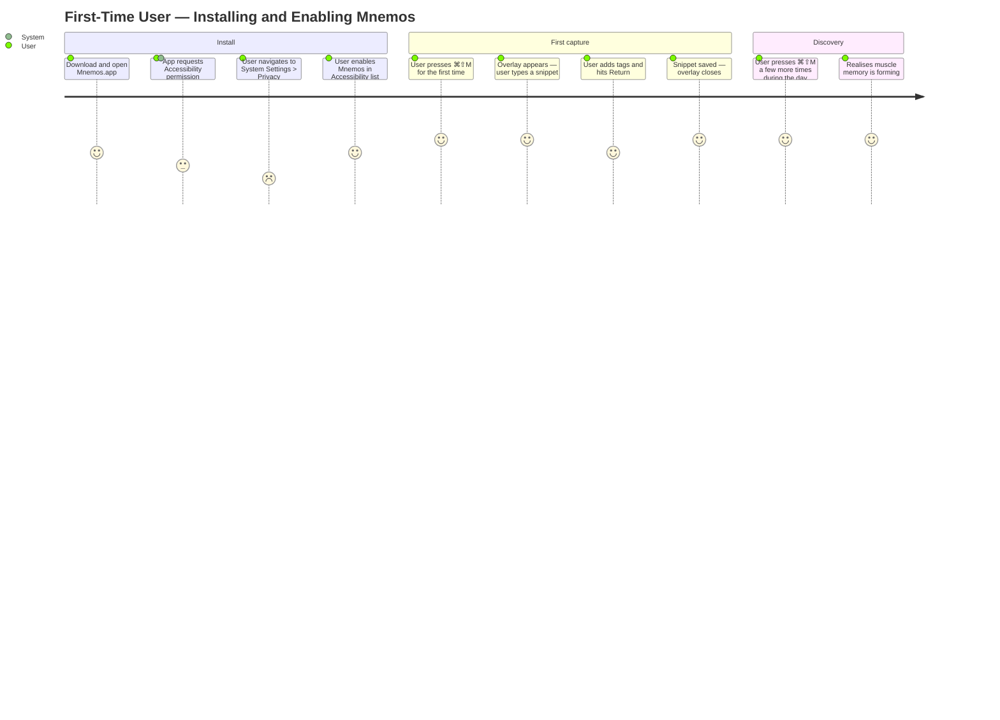
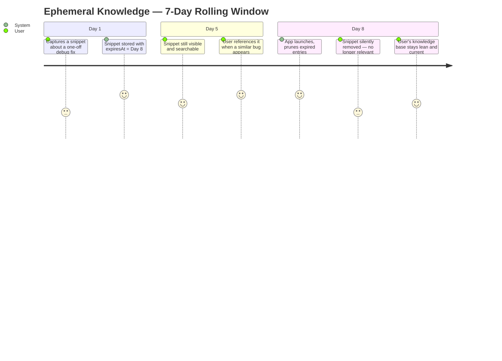

# User Journeys

> Last updated by PR #19 — KnowledgeSnippet and DailyLog models

---

## Journey 1: First-time setup



---

## Journey 2: Daily knowledge capture loop

```mermaid
journey
    title Recurring User — A Day in Mnemos
    section Morning stand-up
      Hears something worth remembering: 4: User
      Presses ⌘⇧M immediately: 5: User
      Captures snippet while context is fresh: 5: User
    section Deep work session
      Discovers a non-obvious architectural pattern: 5: User
      Captures snippet + tags #architecture #swift: 4: User
      Returns to flow without losing momentum: 5: User
    section Code review
      Reviewer leaves useful comment: 3: User
      Captures key insight from review feedback: 4: User
      Tags #code-review #learnings: 3: User
    section End of day
      Briefly opens Mnemos to skim today's log: 3: User
      Sees 4-6 captures — satisfying snapshot of the day: 4: User
```

---

## Journey 3: Knowledge expires (rolling window)



---

## Journey 4: Future — AI skill execution (post-MVP)

```mermaid
journey
    title Power User — Turning Captures into Executable Skills
    section Capture phase
      Accumulates snippets over a week on a topic: 4: User
      Tags consistently — e.g. #onboarding: 3: User
    section Skill creation
      Requests: "Create a skill from my #onboarding snippets": 5: User
      AI synthesises snippets into a structured prompt: 5: System
      User reviews and names the skill "Onboard a new hire": 4: User
    section Execution
      User triggers the skill on demand: 5: User
      AI runs the skill with current context: 5: System
      Output: actionable onboarding plan: 5: User
```
